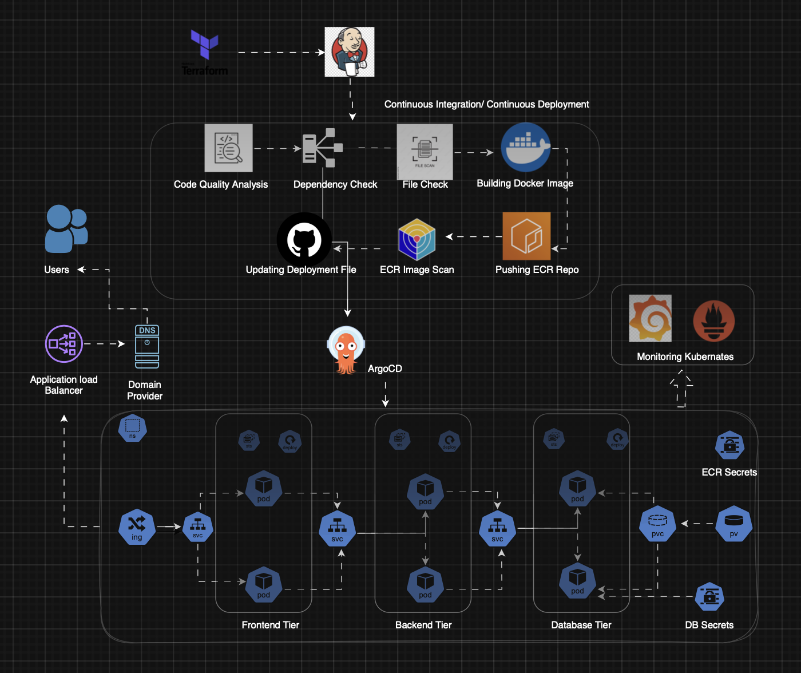

# **Three-Tier Web Application Deployment on AWS EKS**

This project is my hands-on implementation of a **three-tier web application** built with **ReactJS (Frontend)**, **NodeJS (Backend)**, and **MongoDB (Database)** — fully deployed on **Amazon EKS** using a production-grade DevOps toolchain.

It demonstrates **end-to-end DevOps practices** including Infrastructure as Code, CI/CD automation, container orchestration, GitOps, and monitoring — designed for scalability, maintainability, and real-world readiness.

---

## **📽️ Project Architecture**

---

## **📁 Project Components**

- **Application Code** → ReactJS frontend, NodeJS backend, MongoDB database — all containerized with Docker for Kubernetes deployment.  
- **Jenkins Pipeline Code** → Automates build, test, quality checks (SonarQube), image push to AWS ECR, and deployment to EKS.  
- **Jenkins Server Terraform** → Terraform scripts to provision a secure Jenkins server on AWS EC2 with IAM roles, security groups, and storage.  
- **Kubernetes Manifests** → Deployment, Service, Ingress, StatefulSet (for MongoDB), namespace, and secret configurations for EKS.

---

## **🛠️ Tools & Technologies Used**

- **Infrastructure as Code:** Terraform, AWS CLI  
- **CI/CD Automation:** Jenkins, SonarQube, Docker, AWS ECR, kubectl  
- **Monitoring & Logging:** Prometheus, Grafana  
- **GitOps:** ArgoCD for automated Kubernetes deployments  
- **Orchestration:** AWS EKS, Helm for monitoring stack deployment  

---

## **🚢 End-to-End Workflow**

1. Provision AWS infrastructure with Terraform (IAM, networking, EKS, Jenkins server).  
2. Build and containerize application components with Docker.  
3. Run CI/CD pipeline in Jenkins for build, test, quality scan, and deployment.  
4. Push images to private AWS ECR repositories.  
5. Deploy workloads to AWS EKS using Kubernetes manifests.  
6. Monitor application health and performance with Prometheus and Grafana.  
7. Manage deployments using GitOps with ArgoCD.

---

## **🎯 Key Outcome**

This project showcases the **complete lifecycle of a cloud-native application** — from infrastructure provisioning and CI/CD automation to monitoring and GitOps — ready for production-scale deployments.
